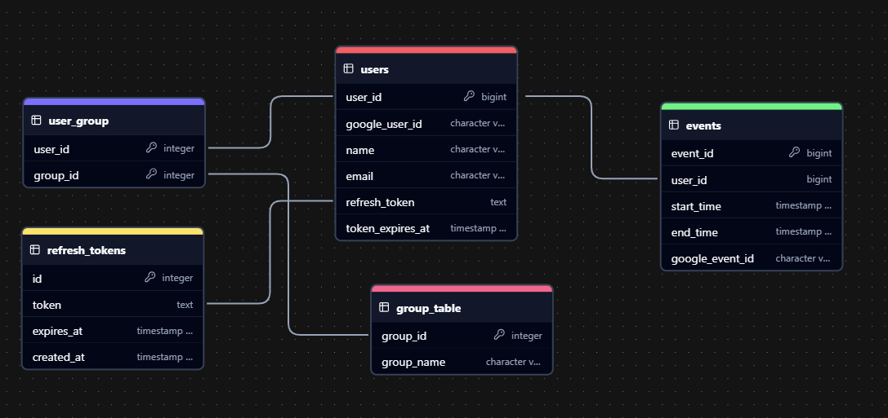

# LinkMe

Making plans can be tough. Or at least I've heard.

LinkMe is a Full-stack Web Application designed to help you and your friends effortlessly find and schedule activities together.

The goal is to synchronize you and your friends free time and connect you with exciting local events and activities so you can spend more time doing and less time planning.
Integrated with Google Calendar & Google Auth.

## 💻 Technology

- **Frontend:** React, Material-UI, React Router, Axios
- **Backend:** Node.js, Express
- **Database:** PostgreSQL, Sequelize ORM
- **Other stuff:** Google Calendar API, Google OAuth 2, TicketMaster API

## Database Diagram

